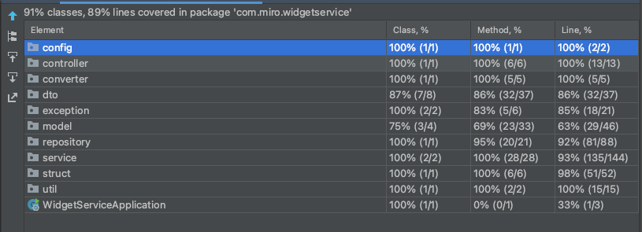

# Widget-service

Miro test task for a backend developer

Swagger available on `http://localhost:8080/swagger-ui.html` also `open-api.yml` in resource package

Request examples in `request-examples` folder in root

There are 2 profiles `memory` and `database`. 
You could change by editing `application.properties` file. 

Сoordinates of the widget are linked to the **lower left** corner.
In order to achieve less than **O(n)** when searching for given coordinates, 
I chose R-tree structure for `memory` profile. Implementation of this you can see in `RTreeStorage.class`. 
For `database` implementation I've made composite index.

# Database

`http://localhost:8080/console`

To get access to database:

**username: sa**

**password:**

Liquibase enabled on h2-database

# Docker

For **docker** here is `docker-run.sh` file. Just run it.

# Test

Test coverage 89%

